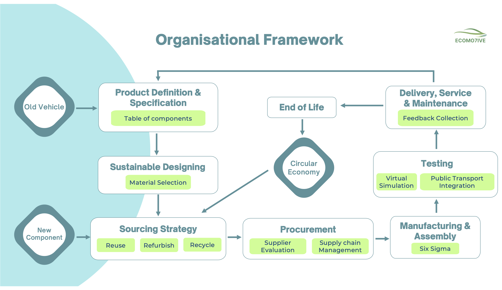

# MSc Consultancy Project – Lifecycle Strategy & Decision Framework  
*MSc Innovation and Technology Management*

## Overview  
This project involved developing a comprehensive, data-driven lifecycle strategy and decision framework to support organisations in making informed operational, commercial, and sustainability decisions. The framework spans the full product lifecycle (from specification and sourcing to manufacturing, use, and end-of-life) and integrates a range of analytical, strategic, and process-improvement tools.

## Overall Lifecycle Framework

## Problem  
Many organisations struggle to evaluate lifecycle impacts, compare alternative materials or technologies, assess supplier performance, and improve process efficiency in a structured way. Decisions are often made in isolation, limiting opportunities to reduce cost, strengthen supply chain resilience, improve sustainability, and enhance competitive advantage. A unified, strategy-driven, and analytical lifecycle framework was needed to address these gaps.

## Analysis Approach  
This project applied a blend of **consulting, analytical, and operations management techniques**, including:

- **Lifecycle Assessment (LCA)** to identify high-impact materials, components, and processes across the lifecycle (pages 6–12).  
- **SMART (Simple Multi-Attribute Rating Technique)** for transparent, multi-criteria decision-making when comparing material options, technologies, and suppliers (pages 7–12).  
- **Supply Chain Analysis** to evaluate risk, traceability, resilience, and performance across tiers (pages 13–16).  
- **Blockchain exploration** to improve supply chain transparency and enable auditable data sharing (page 14).  
- **Six Sigma DMAIC** to analyse inefficiencies in manufacturing workflows and identify process-improvement opportunities (pages 15–17).  
- **Cost–Benefit Analysis** to evaluate trade-offs between economic performance and lifecycle impact.  
- **Competitor and market scanning** to understand industry benchmarks, risks, and emerging practices.  
- **End-of-Life Strategy** covering reuse, remanufacturing, and recycling pathways for key components (pages 18–21).  
- **Project Management & Agile (Scrum)** using JIRA to coordinate tasks, stakeholders, timelines, and iterative development.  
- **Implementation Roadmapping** using the **McKinsey Three Horizons** model and risk analysis (pages 22–24).

## Key Insights  
- Targeted material and supplier decisions can reduce lifecycle emissions by **around 40%**, significantly improving environmental and commercial performance.  
- Multi-criteria decision modelling supports more objective, transparent choices when comparing alternatives with complex trade-offs.  
- Six Sigma revealed several opportunities to improve production efficiency and reduce rework.  
- Increasing traceability—potentially through blockchain—strengthens supply chain trust, reduces risk, and supports regulatory compliance.  
- Lifecycle thinking enables organisations to identify improvement opportunities that span beyond manufacturing, including sourcing, operations, and end-of-life design.

## Strategic Recommendation  
Adopt a phased lifecycle strategy that integrates LCA insights, decision-modelling outputs, supplier evaluation, process optimisation, and digital traceability solutions. Combine short-term operational improvements with long-term innovation opportunities through a multi-horizon approach, ensuring sustainability, cost efficiency, and competitiveness evolve together.

## Outcome  
The project delivered a **holistic, industry-agnostic lifecycle strategy framework** designed to support data-driven decision-making at every stage of a product’s journey. The framework helps organisations evaluate environmental impact, cost, feasibility, and supply chain risk more effectively, ultimately enabling better strategic planning, improved operational efficiency, and more responsible lifecycle management. 

## Tools & Techniques Used  
Lifecycle Assessment (LCA), SMART Decision Modelling, Supply Chain Analysis, Blockchain for Traceability, Six Sigma DMAIC, Cost–Benefit Analysis, Competitor Analysis, Agile (Scrum), JIRA, Project Management, McKinsey Three Horizons, Presentation & Reporting, Research & Documentation.
